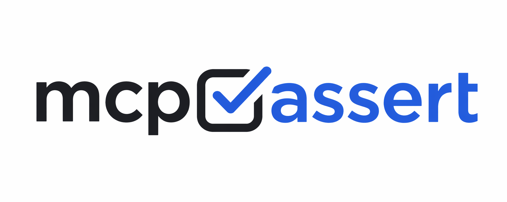
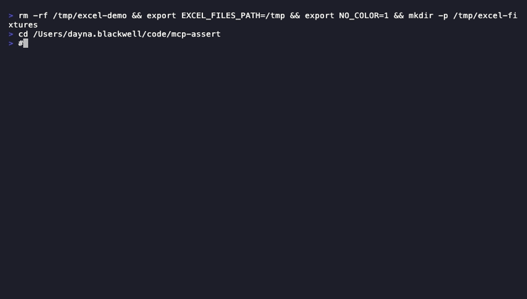
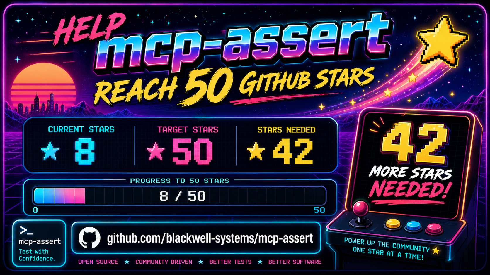

<p align="center">
  
</p>

<p align="center">
  <a href="https://github.com/blackwell-systems"></a>
  <a href="https://go.dev/"></a>
  <a href="LICENSE"></a>
  <a href="https://github.com/blackwell-systems/mcp-assert"></a>
  <a href="https://github.com/blackwell-systems/mcp-assert"></a>
</p>

**Stop using LLMs to test deterministic tools.** Use assertions instead.

mcp-assert is an MCP client. It connects to your server over the real protocol (stdio, SSE, or HTTP), calls tools, and checks the responses against expectations you define in YAML. No mocks, no imports, no language lock-in.

> [!WARNING]
> We scanned 58 MCP servers and found **25 real bugs** across 10 servers. The most common failure: tools crash instead of returning errors agents can recover from. See the [scorecard](https://blackwell-systems.github.io/mcp-assert/scorecard/).

```
Your YAML        ──→  mcp-assert  ──→  MCP Server
(inputs + assertions)    (client)        (any language)
                            │
                        Pass / Fail
```

### Acts like a real agent

mcp-assert connects to your server exactly like a real MCP agent: stdio, SSE, or HTTP transport, full initialize handshake, standard tool calls. **Your server can't tell the difference.** If it works with mcp-assert, it works with Claude, Cursor, Copilot, and every other MCP client.

### Adopted in production

- **[Wyre Technology](https://github.com/wyre-technology)**: 25 MCP servers tested via shared baseline workflow using `mcp-assert-action`
- **[Ant Group (AntV)](https://github.com/antvis/mcp-server-chart)**: integrated into CI within 3 days of launch
- **[Vera](https://github.com/aallan/vera)**: recommended test harness on project roadmap ([#529](https://github.com/aallan/vera/issues/529))
- **Fix PRs merged**: Google, Grafana, LangChain, official MCP SDKs

The testing standard for MCP, like pytest for Python or Jest for JavaScript.

Add it to any MCP server project in one line:

```yaml
- uses: blackwell-systems/mcp-assert-action@v1
  with:
    suite: evals/
```

<p align="center">
  
</p>

> [!NOTE]
> LLMs are for subjective outputs. Assertions are for deterministic ones. Most MCP tools are deterministic. mcp-assert covers them.

## Install

```bash
# npm (no Go required)
npx @blackwell-systems/mcp-assert

# pip (no Go required)
pip install mcp-assert

# Go
go install github.com/blackwell-systems/mcp-assert/cmd/mcp-assert@latest

# Homebrew
brew install blackwell-systems/tap/mcp-assert

# Docker
docker run blackwellsystems/mcp-assert audit --server "npx my-server"

# Snap (Linux)
sudo snap install mcp-assert --classic

# Scoop (Windows)
scoop bucket add blackwell-systems https://github.com/blackwell-systems/scoop-bucket
scoop install mcp-assert

# Winget (Windows)
winget install BlackwellSystems.mcp-assert

# curl | sh (macOS / Linux)
curl -fsSL https://raw.githubusercontent.com/blackwell-systems/mcp-assert/main/install.sh | sh
```

## Quick Start

### Audit any MCP server in seconds. No setup.

Point it at any server:

```bash
mcp-assert audit --server "npx my-mcp-server"
```

```
  Server: my-server
  Transport: stdio
  Score: 83%

  ✓ read_query      1ms  responds, returns content
  ✗ create_table    0ms  internal error: panic: nil pointer...
  ✓ list_tables     1ms  responds, returns content

  3 tools tested, 2 healthy, 1 crashed
```

> [!TIP]
> The audit connects, discovers every tool via `tools/list`, calls each one with schema-generated inputs, and reports which tools crash vs. handle errors properly. No YAML needed. To go deeper, generate assertion files and customize them:


```bash
# Audit + generate starter YAML for CI
mcp-assert audit --server "npx my-mcp-server" --output evals/

# Edit the generated YAMLs: add expected content, setup steps, multi-step flows

# Run in CI with regression detection
mcp-assert ci --suite evals/ --threshold 95
```

### Write assertions from scratch

```bash
# Scaffold your first assertion
mcp-assert init evals                   # Or: init evals --server "my-server" for auto-generation

# Run it
mcp-assert run --suite evals/ --fixture evals/fixtures
```

See the [Getting Started guide](https://blackwell-systems.github.io/mcp-assert/getting-started/) for a full walkthrough.

### Already using Vitest, Jest, Bun, PHPUnit, or pytest?

```bash
# Vitest
npm install -D vitest-mcp-assert
```

```ts
// mcp.test.ts
import { describeMcpSuite } from 'vitest-mcp-assert'
describeMcpSuite('mcp server', 'evals/')
```

```bash
# pytest
pip install pytest-mcp-assert
pytest --mcp-suite evals/
```

> [!IMPORTANT]
> Same YAML files work across the CLI, Vitest, Jest, Bun, PHPUnit, pytest, and Go test. No migration needed. Write once, run anywhere.

## Everything you can do

| Command | What it does | Setup required |
|---------|-------------|----------------|
| `audit --server "..."` | Scan any server, classify every tool as healthy/crashed/timed out | None |
| `fuzz --server "..."` | Throw adversarial inputs at every tool, find crashes and hangs | None |
| `init --server "..."` | Generate a complete test suite from tools/list + capture snapshots | None |
| `run --suite evals/` | Run YAML assertions, report pass/fail | YAML files |
| `ci --suite evals/` | Run with thresholds, baselines, JUnit XML, GitHub Step Summary | YAML files |
| `coverage --suite evals/ --server "..."` | Report which tools have assertions and which don't | YAML files |
| `snapshot --suite evals/ --update` | Capture responses as golden files for regression detection | YAML files |
| `watch --suite evals/` | Re-run on YAML changes, show diffs when status flips | YAML files |
| `matrix --languages go:gopls,ts:tsserver` | Same suite across multiple language servers | YAML files |
| `intercept --server "..." --trajectory t.yaml` | Proxy between agent and server, capture live tool call trace | Trajectory YAML |

Start with `audit` (zero setup), then `fuzz` (adversarial testing), then `init` (generates everything), then customize the YAML for your specific assertions.

## Zero-Effort Coverage

```bash
# Generate stub assertions for every tool the server exposes
mcp-assert generate --server "my-mcp-server" --output evals/ --fixture ./fixtures

# Capture actual outputs as snapshots
mcp-assert snapshot --suite evals/ --server "my-mcp-server" --update

# Assert nothing changed
mcp-assert run --suite evals/ --server "my-mcp-server"
```

## How It Differs From LLM-as-Judge Frameworks

For deterministic tools, mcp-assert is the better fit. For subjective outputs, LLM-as-judge frameworks remain the right choice. Use both if your server mixes tool types.

| Dimension | LLM-as-judge eval frameworks | mcp-assert |
|---|---|---|
| Best for | Subjective outputs (prose, creative content) | Deterministic outputs (data, state, validation) |
| Grading | Language model scoring (flexible, costly) | Assertion-based (exact, free) |
| Speed | Seconds per test (LLM round-trip) | Milliseconds per test (no LLM) |
| CI cost | API calls on every run | Zero external dependencies |
| Reliability | Not measured | pass@k / pass^k per assertion |
| Regression | Not supported | Baseline comparison, fail on backslide |
| Multi-language | Not supported | Same assertion across N language servers |

## Why not just write tests?

You'd need MCP protocol bootstrapping, a server-agnostic runner (your Go tests can't test your TypeScript server), and eval features (regression detection, Docker isolation, JUnit output). mcp-assert handles all of that. One YAML file, any server, any language.

## CI Integration

Use the [mcp-assert GitHub Action](https://github.com/blackwell-systems/mcp-assert-action) for zero-setup CI:

```yaml
- uses: blackwell-systems/mcp-assert-action@v1
  with:
    suite: evals/
    threshold: 95
```

Downloads the binary, runs assertions, uploads JUnit XML results, writes GitHub Step Summary. No Go toolchain required on your runners.

Or run directly:

```bash
mcp-assert ci --suite evals/ --threshold 95 --junit results.xml
```

See the [CI Integration guide](https://blackwell-systems.github.io/mcp-assert/ci-integration/) for JUnit XML, markdown summaries, badges, and regression detection.

## pytest Integration

Run mcp-assert assertions as pytest test items:

```bash
pip install pytest-mcp-assert
pytest --mcp-suite evals/
```

Each YAML file becomes a pytest Item with pass/fail/skip semantics. Configure via `pyproject.toml`:

```toml
[tool.pytest.ini_options]
mcp_suite = "evals/"
mcp_fixture = "fixtures/"
```

Then just run `pytest`. See `pytest-plugin/README.md` for all options.

## Vitest Integration

Run mcp-assert assertions as Vitest tests:

```bash
npm install -D vitest-mcp-assert
```

Auto-discover all YAML files in a directory:

```ts
// mcp.test.ts
import { describeMcpSuite } from 'vitest-mcp-assert'
describeMcpSuite('mcp server', 'evals/')
```

Or run individual assertions:

```ts
import { test } from 'vitest'
import { runMcpAssert } from 'vitest-mcp-assert'
test('echo tool', () => runMcpAssert('evals/echo.yaml'))
```

Same YAML files work across Vitest, pytest, and the CLI. See `vitest-plugin/README.md` for all options.

## Documentation

Full documentation is available at [blackwell-systems.github.io/mcp-assert](https://blackwell-systems.github.io/mcp-assert):

- [Getting Started](https://blackwell-systems.github.io/mcp-assert/getting-started/): install, scaffold, first run
- [Writing Assertions](https://blackwell-systems.github.io/mcp-assert/writing-assertions/): YAML format, all 18 assertion types + 4 trajectory types, 8 block types, 6 test framework plugins (pytest, Vitest, Jest, Bun, PHPUnit, Go test), setup steps, capture, fixtures
- [CLI Reference](https://blackwell-systems.github.io/mcp-assert/cli/): full command reference with flags and examples
- [Examples](https://blackwell-systems.github.io/mcp-assert/examples/): 61 example suites across 7 languages (570 assertions)
- [CI Integration](https://blackwell-systems.github.io/mcp-assert/ci-integration/): GitHub Action, JUnit XML, regression detection
- [Badge](https://blackwell-systems.github.io/mcp-assert/badge/): add the "Works with mcp-assert" badge to your server README
- [Architecture](https://blackwell-systems.github.io/mcp-assert/architecture/): internals and design decisions
- [Roadmap](https://blackwell-systems.github.io/mcp-assert/roadmap/): what's shipped and what's next
- [Scorecard](https://blackwell-systems.github.io/mcp-assert/scorecard/): 20 bugs found across 9 of 55 servers, 6 fix PRs submitted
- [Dogfooding](https://blackwell-systems.github.io/mcp-assert/dogfooding/): findings from testing our own servers

<p align="center">
  
</p>

<p align="center">
  <a href="https://github.com/blackwell-systems/mcp-assert">
    <picture>
      <source media="(prefers-color-scheme: dark)" srcset="assets/star-cta.png">
      <source media="(prefers-color-scheme: light)" srcset="assets/star-cta-light.png">
      
    </picture>
  </a>
</p>

## License

MIT
