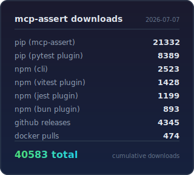

<p align="center">
  
</p>

<h1 align="center">mcp-assert</h1>

[](https://github.com/blackwell-systems)
[](https://go.dev/)
[](LICENSE)
<a href="https://github.com/blackwell-systems/mcp-assert"></a>

The testing standard for deterministic MCP tools. Works with any language, any transport.

A single Go binary that acts as an MCP client: connects to your server over stdio, SSE, or HTTP, calls your tools with predefined inputs, and evaluates the responses against assertions you define in YAML. Your server can't tell the difference between mcp-assert and a real agent. Run in CI to catch regressions on every push. Works with servers written in Go, TypeScript, Python, Rust, Java, C#, Swift, or anything else that speaks MCP.

**Scope:** mcp-assert is built for tools with knowable correct outputs: data retrieval, state changes, validation, navigation. Tools that generate creative content or natural language prose are better evaluated by LLM-as-judge frameworks. Most MCP servers mix both; mcp-assert covers the deterministic majority.

Add it to any MCP server project in one line:

```yaml
- uses: blackwell-systems/mcp-assert-action@v1
  with:
    suite: evals/
```

<p align="center">
  
</p>


## Why

Most MCP tools are deterministic: `read_file` returns file contents, `read_query` returns rows, `get_references` returns locations. Given the same input, the correct output is knowable in advance. You don't need an LLM to grade it. You need `assert.Equal`.

LLM-as-judge frameworks exist for good reason: tools that generate commit messages, write documentation, or suggest creative content produce outputs where quality is genuinely subjective and many correct answers exist. mcp-assert is not a replacement for those frameworks. It is a complement: handle the deterministic majority with assertions, reserve LLM-as-judge for the subjective minority.

### When to use what

| Your tool returns... | Use |
|---|---|
| Structured data (files, rows, locations, symbols) | **mcp-assert**: deterministic assertions |
| Predictable state changes (rename, create, delete) | **mcp-assert**: assert the state after |
| Error responses for bad input | **mcp-assert**: `is_error` and `contains` |
| Natural language (summaries, explanations, descriptions) | **LLM-as-judge**: quality is subjective |
| Creative content (commit messages, code suggestions) | **LLM-as-judge**: many correct answers |
| Mixed (e.g. `create_project` that returns files + generates a README) | **Both**: assert the files, evaluate the prose separately |

Most MCP servers are heavy on the first three and light on the last two. If your server returns data, mcp-assert covers it.

mcp-assert is designed to be the standard testing layer for the deterministic parts of the MCP ecosystem, the way pytest is for Python APIs or Jest is for JavaScript. The [scan-and-contribute scorecard](https://blackwell-systems.github.io/mcp-assert/scorecard/) tracks real bugs found in real MCP servers.

## Why not just write tests in Go/Python/etc?

You could. The assertion logic is straightforward. What you'd have to build yourself:

- **MCP protocol bootstrapping.** stdio transport, JSON-RPC framing, initialize/initialized handshake, tool call request/response lifecycle. This is ~200 lines of boilerplate per test suite, and easy to get wrong.
- **Server-agnostic test runner.** Your Go tests are coupled to your Go server. mcp-assert tests any server from any language with the same YAML. Switch `server.command` from `npx my-ts-server` to `python -m my_server` and the assertions don't change.
- **Eval-framework features.** pass@k/pass^k reliability metrics, baseline regression detection, JUnit XML output, per-assertion Docker isolation (via `docker:` in YAML or `--docker` CLI flag), cross-language matrix mode. These are eval concerns, not unit test concerns.

The value isn't in the assertion logic. It's in not writing MCP client boilerplate, having one tool that works across every MCP server regardless of implementation language, and getting CI-grade reporting for free.

## Install

```bash
# npm (no Go required)
npx @blackwell-systems/mcp-assert

# pip (no Go required)
pip install mcp-assert

# Go
go install github.com/blackwell-systems/mcp-assert/cmd/mcp-assert@latest

# Homebrew
brew install blackwell-systems/tap/mcp-assert

# Scoop (Windows)
scoop bucket add blackwell-systems https://github.com/blackwell-systems/scoop-bucket
scoop install mcp-assert

# Winget (Windows)
winget install BlackwellSystems.mcp-assert

# curl | sh (macOS / Linux)
curl -fsSL https://raw.githubusercontent.com/blackwell-systems/mcp-assert/main/install.sh | sh
```

## Quick Start

### Audit a server in one command

Point `mcp-assert audit` at any MCP server. No YAML, no setup:

```bash
mcp-assert audit --server "npx my-mcp-server"
```

```
  Server: my-server
  Transport: stdio
  Score: 83%

  ✓ read_query      1ms  responds, returns content
  ✗ create_table    0ms  internal error: panic: nil pointer...
  ✓ list_tables     1ms  responds, returns content

  3 tools tested, 2 healthy, 1 crashed
```

The audit connects, discovers every tool via `tools/list`, calls each one with schema-generated inputs, and reports which tools crash vs. handle errors properly. This is discovery: it tests crash resistance and error handling, not business logic.

To go deeper, generate assertion YAML files and customize them:

```bash
# Audit + generate starter YAML for CI
mcp-assert audit --server "npx my-mcp-server" --output evals/

# Edit the generated YAMLs: add expected content, setup steps, multi-step flows

# Run in CI with regression detection
mcp-assert ci --suite evals/ --threshold 95
```

### Write assertions from scratch

```bash
# Scaffold your first assertion
mcp-assert init evals                   # Or: init evals --server "my-server" for auto-generation

# Run it
mcp-assert run --suite evals/ --fixture evals/fixtures
```

See the [Getting Started guide](https://blackwell-systems.github.io/mcp-assert/getting-started/) for a full walkthrough.

### Already using Vitest or pytest?

```bash
# Vitest
npm install -D vitest-mcp-assert
```

```ts
// mcp.test.ts
import { describeMcpSuite } from 'vitest-mcp-assert'
describeMcpSuite('mcp server', 'evals/')
```

```bash
# pytest
pip install pytest-mcp-assert
pytest --mcp-suite evals/
```

Same YAML files, native test runner output. No migration needed.

## Zero-Effort Coverage

```bash
# Generate stub assertions for every tool the server exposes
mcp-assert generate --server "my-mcp-server" --output evals/ --fixture ./fixtures

# Capture actual outputs as snapshots
mcp-assert snapshot --suite evals/ --server "my-mcp-server" --update

# Assert nothing changed
mcp-assert run --suite evals/ --server "my-mcp-server"
```

## How It Differs From LLM-as-Judge Frameworks

For deterministic tools, mcp-assert is the better fit. For subjective outputs, LLM-as-judge frameworks remain the right choice. Use both if your server mixes tool types.

| Dimension | LLM-as-judge eval frameworks | mcp-assert |
|---|---|---|
| Best for | Subjective outputs (prose, creative content) | Deterministic outputs (data, state, validation) |
| Grading | Language model scoring (flexible, costly) | Assertion-based (exact, free) |
| Speed | Seconds per test (LLM round-trip) | Milliseconds per test (no LLM) |
| CI cost | API calls on every run | Zero external dependencies |
| Reliability | Not measured | pass@k / pass^k per assertion |
| Regression | Not supported | Baseline comparison, fail on backslide |
| Multi-language | Not supported | Same assertion across N language servers |

## CI Integration

Use the [mcp-assert GitHub Action](https://github.com/blackwell-systems/mcp-assert-action) for zero-setup CI:

```yaml
- uses: blackwell-systems/mcp-assert-action@v1
  with:
    suite: evals/
    threshold: 95
```

Downloads the binary, runs assertions, uploads JUnit XML results, writes GitHub Step Summary. No Go toolchain required on your runners.

Or run directly:

```bash
mcp-assert ci --suite evals/ --threshold 95 --junit results.xml
```

See the [CI Integration guide](https://blackwell-systems.github.io/mcp-assert/ci-integration/) for JUnit XML, markdown summaries, badges, and regression detection.

## pytest Integration

Run mcp-assert assertions as pytest test items:

```bash
pip install pytest-mcp-assert
pytest --mcp-suite evals/
```

Each YAML file becomes a pytest Item with pass/fail/skip semantics. Configure via `pyproject.toml`:

```toml
[tool.pytest.ini_options]
mcp_suite = "evals/"
mcp_fixture = "fixtures/"
```

Then just run `pytest`. See `pytest-plugin/README.md` for all options.

## Vitest Integration

Run mcp-assert assertions as Vitest tests:

```bash
npm install -D vitest-mcp-assert
```

Auto-discover all YAML files in a directory:

```ts
// mcp.test.ts
import { describeMcpSuite } from 'vitest-mcp-assert'
describeMcpSuite('mcp server', 'evals/')
```

Or run individual assertions:

```ts
import { test } from 'vitest'
import { runMcpAssert } from 'vitest-mcp-assert'
test('echo tool', () => runMcpAssert('evals/echo.yaml'))
```

Same YAML files work across Vitest, pytest, and the CLI. See `vitest-plugin/README.md` for all options.

## Documentation

Full documentation is available at [blackwell-systems.github.io/mcp-assert](https://blackwell-systems.github.io/mcp-assert):

- [Getting Started](https://blackwell-systems.github.io/mcp-assert/getting-started/): install, scaffold, first run
- [Writing Assertions](https://blackwell-systems.github.io/mcp-assert/writing-assertions/): YAML format, all 18 assertion types + 4 trajectory types, 7 block types (assert, assert_prompts, assert_resources, assert_completion, assert_sampling, assert_logging, trajectory), setup steps, capture, fixtures
- [CLI Reference](https://blackwell-systems.github.io/mcp-assert/cli/): full command reference with flags and examples
- [Examples](https://blackwell-systems.github.io/mcp-assert/examples/): 61 example suites across 7 languages (570 assertions)
- [CI Integration](https://blackwell-systems.github.io/mcp-assert/ci-integration/): GitHub Action, JUnit XML, regression detection
- [Badge](https://blackwell-systems.github.io/mcp-assert/badge/): add the "Works with mcp-assert" badge to your server README
- [Architecture](https://blackwell-systems.github.io/mcp-assert/architecture/): internals and design decisions
- [Roadmap](https://blackwell-systems.github.io/mcp-assert/roadmap/): what's shipped and what's next
- [Scorecard](https://blackwell-systems.github.io/mcp-assert/scorecard/): 20 bugs found across 9 of 55 servers, 6 fix PRs submitted
- [Dogfooding](https://blackwell-systems.github.io/mcp-assert/dogfooding/): findings from testing our own servers

<p align="center">
  
</p>

<p align="center">
  <a href="https://github.com/blackwell-systems/mcp-assert">
    <picture>
      <source media="(prefers-color-scheme: dark)" srcset="assets/star-cta.png">
      <source media="(prefers-color-scheme: light)" srcset="assets/star-cta-light.png">
      
    </picture>
  </a>
</p>

## License

MIT
