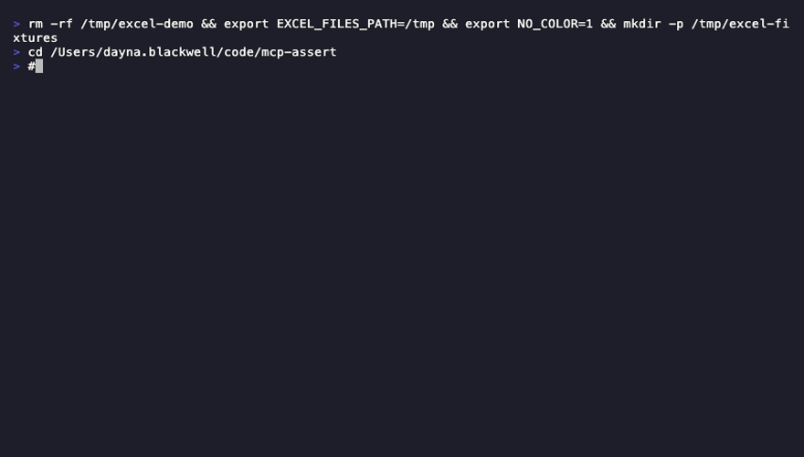
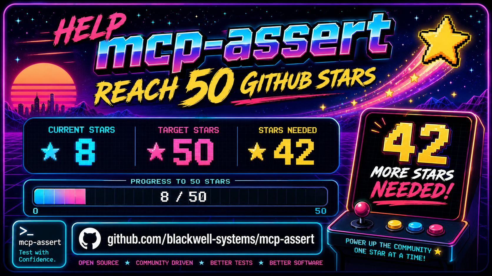

[English](../../README.md) · [简体中文](README.zh-CN.md) · [Русский](README.ru.md) · [हिन्दी](README.hi.md) · **العربية**

<p align="center">
  
</p>

<p align="center">
  <a href="https://github.com/blackwell-systems"></a>
  <a href="https://go.dev/"></a>
  <a href="../../LICENSE"></a>
  <a href="https://github.com/blackwell-systems/mcp-assert"></a>
  <a href="https://github.com/blackwell-systems/mcp-assert"></a>
</p>

**اختبر خادم MCP الخاص بك مقابل البروتوكول الحقيقي. بلا mocks. بلا imports. بلا ارتباط بلغة معينة.**

يتصل mcp-assert بخادمك تمامًا كما يفعل Claude أو Cursor أو أي عميل MCP آخر: نقل stdio/SSE/HTTP حقيقي، ومصافحة initialize كاملة، واستدعاءات أدوات فعلية. وهو يتحقق من الاستجابات مقابل التوقعات التي تحددها في YAML. إذا اجتاز mcp-assert، فإنه يعمل مع كل عميل MCP.

> [!WARNING]
> فحصنا 102 خادم MCP ووجدنا **4,794 مشكلة في المخطط (schema)** (منها 2,239 خطأً) عبر 55 خادمًا تشمل AWS وSerena وGrafana. أكثر الأعطال شيوعًا: افتقار المعاملات إلى تعريفات الأنواع يجعل الوكلاء (agents) يرسلون أنواع قيم خاطئة. راجع [بطاقة النتائج](https://blackwell-systems.github.io/mcp-assert/scorecard/).

```
Your YAML        ──→  mcp-assert  ──→  MCP Server
(inputs + assertions)    (client)        (any language)
                            │
                        Pass / Fail
```

### خادمك لن يلاحظ الفرق

يتحدث mcp-assert بروتوكول MCP الكامل: مصافحة initialize، والاكتشاف عبر `tools/list`، و`tools/call` بوسائط حقيقية. وهو يعثر على العلل التي تفوتها اختبارات الوحدة لأنه يختبر عبر السلك، لا داخل العملية.

### مُعتمَد في بيئة الإنتاج

- **[Wyre Technology](https://github.com/wyre-technology)**: تم اختبار 25 خادم MCP عبر سير عمل baseline مشترك باستخدام `mcp-assert-action`
- **[Ant Group (AntV)](https://github.com/antvis/mcp-server-chart)**: تم دمجه في CI خلال 3 أيام من الإطلاق
- **[Vera](https://github.com/aallan/vera)**: إطار الاختبار الموصى به في خارطة طريق المشروع ([#529](https://github.com/aallan/vera/issues/529))
- **طلبات دمج (PR) للإصلاح تم دمجها**: Google وGrafana وLangChain و MCP SDKs الرسمية

معيار الاختبار لـ MCP، مثل pytest لـ Python أو Jest لـ JavaScript.

أضِفه إلى أي مشروع خادم MCP بسطر واحد:

```yaml
- uses: blackwell-systems/mcp-assert-action@v1
  with:
    suite: evals/
```

<p align="center">
  
</p>

> [!NOTE]
> نماذج LLM مخصصة للمخرجات الذاتية. التأكيدات (assertions) مخصصة للمخرجات الحتمية. معظم أدوات MCP حتمية. و mcp-assert يغطيها.

## التثبيت

```bash
# npm (no Go required)
npx @blackwell-systems/mcp-assert

# pip (no Go required)
pip install mcp-assert

# Go
go install github.com/blackwell-systems/mcp-assert/cmd/mcp-assert@latest

# Homebrew
brew install blackwell-systems/tap/mcp-assert

# Docker
docker run blackwellsystems/mcp-assert audit --server "npx my-server"

# Snap (Linux)
sudo snap install mcp-assert --classic

# Scoop (Windows)
scoop bucket add blackwell-systems https://github.com/blackwell-systems/scoop-bucket
scoop install mcp-assert

# Winget (Windows)
winget install BlackwellSystems.mcp-assert

# curl | sh (macOS / Linux)
curl -fsSL https://raw.githubusercontent.com/blackwell-systems/mcp-assert/main/install.sh | sh
```

## البدء السريع

### دقّق أي خادم MCP في ثوانٍ. بلا إعداد.

وجّهه إلى أي خادم:

```bash
mcp-assert audit --server "npx my-mcp-server"
```

```
  Server: my-server
  Transport: stdio
  Score: 83%

  ✓ read_query      1ms  [E000] responds, returns content
  ✗ create_table    0ms  [E201] internal error: panic: nil pointer...
  ✓ list_tables     1ms  [E000] responds, returns content

  3 tools tested, 2 healthy, 1 crashed
```

تُصنّف أكواد الأخطاء المنظَّمة المشكلات فورًا. راجع [مرجع الأخطاء](../../docs/ERROR_REFERENCE.md) لجميع الأكواد الـ 24.

> [!TIP]
> يتصل التدقيق، ويكتشف كل أداة عبر `tools/list`، ويستدعي كل واحدة بمدخلات مولَّدة من المخطط، ويُبلغ عن الأدوات التي تنهار مقابل تلك التي تعالج الأخطاء بشكل سليم. لا حاجة إلى YAML. وللتعمق أكثر، ولّد ملفات التأكيدات وخصّصها:


```bash
# Audit + generate starter YAML for CI
mcp-assert audit --server "npx my-mcp-server" --output evals/

# Edit the generated YAMLs: add expected content, setup steps, multi-step flows

# Run in CI with regression detection
mcp-assert ci --suite evals/ --threshold 95
```

### اكتب التأكيدات من الصفر

```bash
# Scaffold your first assertion
mcp-assert init evals                   # Or: init evals --server "my-server" for auto-generation

# Run it
mcp-assert run --suite evals/ --fixture evals/fixtures
```

راجع [دليل البدء](https://blackwell-systems.github.io/mcp-assert/getting-started/) للاطلاع على شرح كامل.

### تستخدم بالفعل Vitest أو Jest أو Bun أو PHPUnit أو pytest؟

```bash
# Vitest
npm install -D @blackwell-systems/vitest-mcp-assert
```

```ts
// mcp.test.ts
import { describeMcpSuite } from '@blackwell-systems/vitest-mcp-assert'
describeMcpSuite('mcp server', 'evals/')
```

```bash
# pytest
pip install pytest-mcp-assert
pytest --mcp-suite evals/
```

> [!IMPORTANT]
> تعمل ملفات YAML نفسها عبر CLI وVitest وJest وBun وPHPUnit وpytest وGo test. لا حاجة إلى ترحيل. اكتب مرة واحدة، وشغّل في أي مكان.

## كل ما يمكنك فعله

| الأمر | ما الذي يفعله | الإعداد المطلوب |
|---------|-------------|----------------|
| `audit --server "..."` | افحص أي خادم، وصنّف كل أداة على أنها سليمة/منهارة/انتهت مهلتها | لا شيء |
| `fuzz --server "..."` | ارمِ مدخلات عدائية على كل أداة، واعثر على الانهيارات والتعليقات | لا شيء |
| `init --server "..."` | ولّد مجموعة اختبار كاملة من tools/list + التقط اللقطات | لا شيء |
| `run --suite evals/` | شغّل تأكيدات YAML، وأبلغ بالنجاح/الفشل | ملفات YAML |
| `ci --suite evals/` | شغّل مع العتبات وخطوط الأساس وJUnit XML وGitHub Step Summary | ملفات YAML |
| `coverage --suite evals/ --server "..."` | أبلغ عن الأدوات التي لديها تأكيدات وتلك التي ليست لديها | ملفات YAML |
| `snapshot --suite evals/ --update` | التقط الاستجابات كملفات golden لكشف الانحدار | ملفات YAML |
| `watch --suite evals/` | أعِد التشغيل عند تغييرات YAML، وأظهر الفروق عند انقلاب الحالة | ملفات YAML |
| `matrix --languages go:gopls,ts:tsserver` | المجموعة نفسها عبر عدة خوادم لغوية | ملفات YAML |
| `intercept --server "..." --trajectory t.yaml` | كن وسيطًا بين الوكيل والخادم، والتقط أثر استدعاءات الأدوات الحيّة | Trajectory YAML |
| `lint --server "..."` | 24 قاعدة تحليل ساكن لقابلية استخدام الوكيل؛ `--fix` يولّد تحسينات المخطط تلقائيًا | لا شيء |

ابدأ بـ `audit` (بلا إعداد)، ثم `fuzz` (اختبار عدائي)، ثم `init` (يولّد كل شيء)، ثم خصّص YAML لتأكيداتك المحددة.

## تغطية بلا جهد

```bash
# Generate stub assertions for every tool the server exposes
mcp-assert generate --server "my-mcp-server" --output evals/ --fixture ./fixtures

# Capture actual outputs as snapshots
mcp-assert snapshot --suite evals/ --server "my-mcp-server" --update

# Assert nothing changed
mcp-assert run --suite evals/ --server "my-mcp-server"
```

## Lint + الإصلاح التلقائي

يلتقط التحليل الساكن مشكلات المخطط دون تنفيذ الأدوات. تكتشف 24 قاعدة المشكلات التي تُسبب فشل الوكلاء:

```bash
mcp-assert lint --server "npx my-mcp-server"
```

```
  E  E103   create_entities       Required parameter "entities" has no description
  W  W114   generate_chart        Input schema is 5 levels deep. LLMs struggle with nesting
  W  W112   (server)              Server exposes 27 tools. LLM accuracy degrades beyond 20

5 error(s), 11 warning(s)
```

ولّد الإصلاحات تلقائيًا:

```bash
mcp-assert lint --server "npx my-mcp-server" --fix
```

```
memory-server: 9 tools, 25 findings, 23 auto-fixable

  E103   create_entities   Add description: "The entities value (array)"
  W109   search_nodes      Add examples to "query": [search term]
  W116   read_graph        Append: "Returns the graph data as JSON."

23 fixes generated.
```

استخدم `--strict` في CI للفشل عند التحذيرات:

```bash
mcp-assert lint --server "..." --strict --threshold 0
```

## كيف يختلف عن أطر عمل LLM-as-Judge

بالنسبة للأدوات الحتمية، يُعد mcp-assert الأنسب. أما بالنسبة للمخرجات الذاتية، فتظل أطر عمل LLM-as-judge هي الخيار الصحيح. استخدم كليهما إذا كان خادمك يمزج بين أنواع الأدوات.

| البُعد | أطر عمل تقييم LLM-as-judge | mcp-assert |
|---|---|---|
| الأفضل لـ | المخرجات الذاتية (النثر، المحتوى الإبداعي) | المخرجات الحتمية (البيانات، الحالة، التحقق) |
| التقييم | تقييم بنموذج لغوي (مرن، مكلف) | قائم على التأكيدات (دقيق، مجاني) |
| السرعة | ثوانٍ لكل اختبار (جولة ذهاب وإياب مع LLM) | أجزاء من الثانية لكل اختبار (بلا LLM) |
| تكلفة CI | استدعاءات API في كل تشغيل | صفر تبعيات خارجية |
| الموثوقية | غير مقيسة | pass@k / pass^k لكل تأكيد |
| الانحدار | غير مدعوم | مقارنة بخط الأساس، الفشل عند التراجع |
| تعدد اللغات | غير مدعوم | التأكيد نفسه عبر N خادمًا لغويًا |

## لماذا لا تكتب الاختبارات فحسب؟

ستحتاج إلى تمهيد بروتوكول MCP، ومشغّل مستقل عن الخادم (اختبارات Go لديك لا يمكنها اختبار خادم TypeScript الخاص بك)، وميزات تقييم (كشف الانحدار، عزل Docker، مخرجات JUnit). يتكفل mcp-assert بكل ذلك. ملف YAML واحد، أي خادم، أي لغة.

## التكامل مع CI

استخدم [GitHub Action الخاص بـ mcp-assert](https://github.com/blackwell-systems/mcp-assert-action) لـ CI بلا إعداد:

```yaml
- uses: blackwell-systems/mcp-assert-action@v1
  with:
    suite: evals/
    threshold: 95
```

يُنزّل الملف الثنائي، ويشغّل التأكيدات، ويرفع نتائج JUnit XML، ويكتب GitHub Step Summary. لا حاجة إلى سلسلة أدوات Go على مشغّلاتك.

أو شغّله مباشرةً:

```bash
mcp-assert ci --suite evals/ --threshold 95 --junit results.xml
```

للاطلاع على JUnit XML وملخصات markdown والشارات وكشف الانحدار، راجع [دليل التكامل مع CI](https://blackwell-systems.github.io/mcp-assert/ci-integration/).

## التكامل مع pytest

شغّل تأكيدات mcp-assert كعناصر اختبار pytest:

```bash
pip install pytest-mcp-assert
pytest --mcp-suite evals/
```

يصبح كل ملف YAML عنصر Item في pytest بدلالات نجاح/فشل/تخطٍّ. اضبطه عبر `pyproject.toml`:

```toml
[tool.pytest.ini_options]
mcp_suite = "evals/"
mcp_fixture = "fixtures/"
```

ثم شغّل `pytest` فحسب. راجع `pytest-plugin/README.md` لجميع الخيارات.

## التكامل مع Vitest

شغّل تأكيدات mcp-assert كاختبارات Vitest:

```bash
npm install -D @blackwell-systems/vitest-mcp-assert
```

اكتشف تلقائيًا جميع ملفات YAML في دليل ما:

```ts
// mcp.test.ts
import { describeMcpSuite } from '@blackwell-systems/vitest-mcp-assert'
describeMcpSuite('mcp server', 'evals/')
```

أو شغّل تأكيدات فردية:

```ts
import { test } from 'vitest'
import { runMcpAssert } from '@blackwell-systems/vitest-mcp-assert'
test('echo tool', () => runMcpAssert('evals/echo.yaml'))
```

تعمل ملفات YAML نفسها عبر Vitest وpytest وCLI. راجع `vitest-plugin/README.md` لجميع الخيارات.

## التوثيق

التوثيق الكامل متاح على [blackwell-systems.github.io/mcp-assert](https://blackwell-systems.github.io/mcp-assert):

- [البدء](https://blackwell-systems.github.io/mcp-assert/getting-started/): التثبيت، السقالة، التشغيل الأول
- [كتابة التأكيدات](https://blackwell-systems.github.io/mcp-assert/writing-assertions/): صيغة YAML، جميع أنواع التأكيدات الـ 18 + 4 أنواع مسارات، 8 أنواع كتل، 6 إضافات لأطر الاختبار (pytest، Vitest، Jest، Bun، PHPUnit، Go test)، خطوات setup، capture، fixtures
- [مرجع CLI](https://blackwell-systems.github.io/mcp-assert/cli/): مرجع أوامر كامل مع الأعلام والأمثلة
- [أمثلة](https://blackwell-systems.github.io/mcp-assert/examples/): 65 مجموعة مثال عبر 8 لغات (606 تأكيدًا)
- [التكامل مع CI](https://blackwell-systems.github.io/mcp-assert/ci-integration/): GitHub Action، JUnit XML، كشف الانحدار
- [الشارة](https://blackwell-systems.github.io/mcp-assert/badge/): أضف شارة "Works with mcp-assert" إلى README خادمك
- [البنية](https://blackwell-systems.github.io/mcp-assert/architecture/): التفاصيل الداخلية وقرارات التصميم
- [خارطة الطريق](https://blackwell-systems.github.io/mcp-assert/roadmap/): ما تم شحنه وما هو قادم
- [بطاقة النتائج](https://blackwell-systems.github.io/mcp-assert/scorecard/): تم العثور على 32 علة عبر 13 خادمًا، وتقديم 9 طلبات دمج للإصلاح، وفحص 58 خادمًا

<p align="center">
  
</p>

<p align="center">
  <a href="https://github.com/blackwell-systems/mcp-assert">
    <picture>
      <source media="(prefers-color-scheme: dark)" srcset="assets/star-cta.png">
      <source media="(prefers-color-scheme: light)" srcset="assets/star-cta-light.png">
      
    </picture>
  </a>
</p>

## الترخيص

MIT
